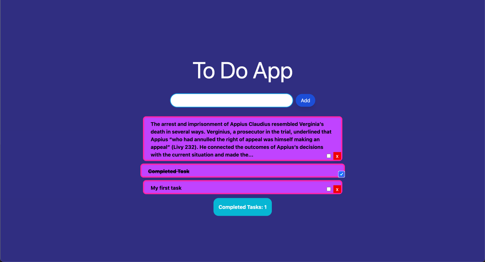
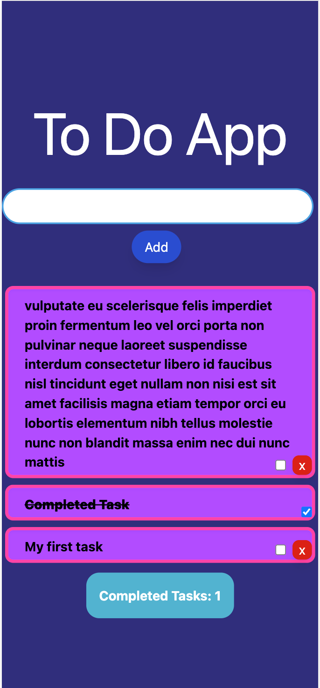

# To Do App

# A mobile friendly To-Do Web App

## Tech Stack

- Typescript
- React
- Redux Toolkit
- Tailwind CSS

## Features

1. Add tasks
2. Completed tasks will be counted and strikeout font applied
3. Tasks can be deleted
4. Mobile friendly UI

## How to use

1. Add task by filling in the input field and selecting the add button. Your new task will be added to the top of the list
2. Once completed select the checkbox and strikeout font will be triggered. The completed task will be added to the counter below the task list
3. Click on the cross button to delete a task

## Known Bugs

- Selected checkbox glitches when new tasks are added.

## Screenshots

